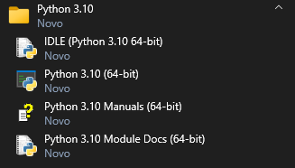
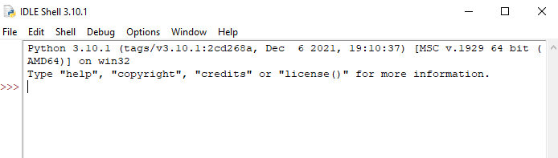
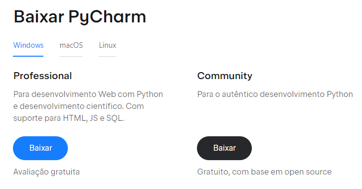
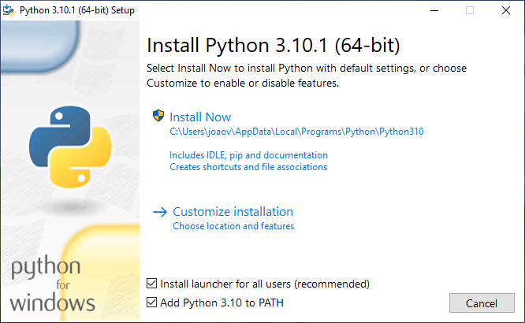

# INTRODUÇÃO

Se você chegou até aqui, provavelmente tem interesse em aprender sobre essa linguagem de programação.

Desde já agradeço a confiança e espero que esse conteúdo possa te possibilitar uma ótima experiência de aprendizado.

## O que o Python é?

Vamos definir em alguns tópicos.

### Livre

Gratuito para instalar, utilizar e desenvolver.

### Linguagem de propósito geral

Você pode fazer tudo com python. Certo, tudo é exagero, dá para fazer muita coisa, desde de desenvolvimento web até análise de dados. Extremamente completa e versátil.

### Fácil e intuitiva

Um tópico que pode levantar dúvidas. Prometo que após estudar a documentação conseguirei de maneira 

Se formos comparar com C,C++ e até Java

- Multiplataforma
- Batteries included
- Organizada
- Orientada a Objetos
- Muitas bibliotecas

# Historinha do Python

A história do Python começa em 1982, em Amsterdam, capital da Holanda, onde fica o CWI(Centrum Wiskunde & Informatica).

Nesse local foram criadas algumas linguagens de programação, como por exemplo a linguagem Algol e a linguagem ABC, que foi onde Guidom Van Jossum trabalhava na criação da linguagem. Com os conhecimentos absorvidos durante esse período, em 1989 ele criou uma linguagem de programação mais simples, devido aos problemas que ele teve em linguagem C. Dentro do departamento do CWI havia um padrão para nomeação dos projetos, eram sempre inspirados em programas de televisão então Jossum decidiu homenagear o seu programa de humor favorito, “Monty Python´s Flying Circus”. Uma das primeiras editoras a lançar um livro sobre a linguagem foi a “O'Reilly Media”, que tinha por costume utilizar animais em sua capa e como você deve imaginar, o primeiro livro recebeu uma serpente python na capa(algo que os criadores tentaram evitar no início). A partir daí a linguagem tomou fama e os criadores abraçaram a ideia com mais facilidade.

As primeiras versões de python foram lançadas no início dos anos 90 e linguagem começou a construir uma comunidade de pessoas interessadas em suas simplicidade. Em 1995 Jossum saiu da Holanda e veio para os Estados Unidos para ensinar as pessoas a programar e iniciou um projeto chamado “CP4E”(Computer Programming for Everybody), recebendo financiamento do ARPA e em 2001, a linguagem já tinha ganhado muito “corpo”, nasceu a PSF(Python Software Fundation), que é uma fundação sem fins lucrativos cujo trabalho é coordenar a linguagem. A linguagem evolui de acordo com a comunidade. A PSF é patrocinada pela Microsoft, Google e até mesmo pela Globo. É uma linguagem que já vem instalada em alguns sistemas operacionais.

## Zen Of Python

É uma filosofia criada por um dos criadores, chamado Tim Peters, com objetivo de descrever a linguagem com coisas que quem programa em Python deveria saber.

O Zen de Python, por Tim Peters

Bonito é melhor do que feio.
Explícito é melhor do que implícito.
Simples é melhor do que complexo.
Complexo é melhor do que complicado.
Flat é melhor do que aninhado.
Esparso é melhor que denso.
A legibilidade conta.
Casos especiais não são especiais o suficiente para quebrar as regras.
Embora a praticidade supere a pureza.
Os erros nunca devem passar silenciosamente.
A menos que explicitamente silenciado.
Diante da ambiguidade, recuse a tentação de adivinhar.
Deve haver uma... e de preferência apenas uma maneira óbvia de fazê-lo.
Embora dessa forma não seja óbvio no início, a menos que você seja holandês.
Agora é melhor do que nunca.
Embora nunca seja melhor do que agora.
Se a implementação é difícil de explicar, é uma má ideia.
Se a implementação é fácil de explicar, pode ser uma boa ideia.
Namespaces são uma ótima ideia buzinando - vamos fazer mais desses!

## **Para que é usado o Python?**

Como já citado acima, o Python é uma linguagem muito popular nas áreas da tecnologia relacionadas à análise de dados, pesquisa, desenvolvimento de algoritmos e IA. Mas, afinal, o que pode ser feito em Python?

Abaixo, detalharei um pouco mais suas utilizações em cada uma destas áreas.

### Scripting e automação

Automatizar tarefas é um dos maiores objetivos de um profissional de tecnologia.

E desenvolver scripts de automação com Python é totalmente possível e rápido graças às suas várias bibliotecas nativas, disponíveis junto com sua instalação.

### Desenvolvimento web

Uma das aplicações mais comuns do Python é o desenvolvimento de aplicações para web. Desde sites simples, como hotpages para ações de marketing, quanto ERPs capazes de administrar empresas e realizar vendas de produtos e serviços.

A linguagem possui uma extensa variedade de frameworks para todos os tipos de gosto, entre eles os famosos Django, Flask e FastAPI.

### Enquadramento de testes

Se o momento de realizar testes era um momento desagradável no seu dia de trabalho, saiba que com o Python a sua vida será muito mais animada.

Ele possui um grande volume de estruturas de testes integradas, além de diversos módulos voltados exclusivamente para o enquadramento de testes.

Então, utilizar o Python é poder ter a certeza que sua aplicação poderá ser testada com muita eficiência.

Isso justifica por que desenvolvedores de software em Python adoram utilizar TDD (Test Driven Development), trazendo mais segurança e confiança aos seus projetos.

### Big Data

A análise e interpretação de grandes volumes de dados, área de conhecimento que chamados de Big Data, é um dos mais populares campos onde Python tem se tornado a linguagem favorita.

Por ser facilmente compreendida por profissionais de diversas especialidades, o Python é, antes de tudo, um facilitador.

Além disso, duas características principais o levam a ser ótimo para essa tarefa: criação de scripts e a facilidade em utilizar as várias bibliotecas gratuitas desenvolvidas em parcerias com especialistas de várias áreas.

É possível analisar, processar e também exibir os dados com muita eficiência e clareza.

Embora ainda haja grandes concorrentes, como o R, por exemplo, o Python, assim como o próprio Big Data, está com a sua notoriedade no auge.

### Ciência de dados

Acompanhando o próprio avanço da indústria tecnológica, o crescente número de bibliotecas disponíveis em Python voltadas à análise de dados oferece funções e métodos de otimização para praticamente quaisquer objetivos.

A grande comunidade de Python, não apenas internacional mas também no Brasil, é um poderoso atrativo: o compartilhamento de soluções e informações entre profissionais da área diminui consideravelmente as chances de um programador precisar lidar com um problema sem solução aparente.

### Computação gráfica

Se você já assistiu aos mais recentes filmes da saga Star Wars, saiba que todos os seus efeitos de computação gráfica, produzidos pela Industrial Light & Magic, envolveu a linguagem Python.

Além de haver vários pacotes de soluções para esta área, como PyOpenGL e PyGame, há ainda o poderoso software de criação de gráficos 3D, o Blender, que utiliza o Python como linguagem principal.

### Inteligência artificial

Quando você faz uma busca no Google e encontra exatamente a resposta que esperava, o Python desempenhou exatamente o papel que se esperava de sua atuação.

Isso porque os algoritmos e modelos de inteligência artificial presentes no  buscador, elaborados para predizer a sua intenção de busca, são em sua maioria desenvolvidos nesta linguagem.

Entre as bibliotecas mais comuns voltadas ao aprendizado de máquina estão o TensorFlow, PyThorch, Theano, Keras e outras.
<<<<<<< HEAD

# Instalação

Clique no link: [https://www.python.org/](https://www.python.org/)
Após abrir a página, vá em “Downloads” e baixe a versão mais recente para sua plataforma, durante a escrita deste documento a versão era 3.10.1.



A segunda opção habilita o uso do Python no Terminal.

O pacote do Python vem com o interpretador, com o ambiente IDLE e com as “batteries included”, que são as multi biblioteca padrão que vem na linguagem.
Agora vamos abrir a pasta do Python no Windows 10 e lá podemos identificar as seguintes informações:



Você pode utilizar o Python diretamente no terminal ou no IDLE, que é um ambiente mais “facilitado” para o uso da linguagem.



Já é possível trabalhar de forma tranquila com ele, no entanto iremos aprender sobre outro programa muito utilizado quando se fala em Python, que é o Pycharm.

Clique no link: [https://www.jetbrains.com/pt-br/pycharm/download/](https://www.jetbrains.com/pt-br/pycharm/download/)



A versão Community é gratuita.

Também é possível utilizar o VSCODE, mas isso irá depender de sua preferência.

Para rodar o python no VSCODE basta instalar a extensão “Code Runner”.

# Comentários

Python ignora comentários e você pode usá-los para escrever notas ou lembrar a si mesmo o que o código está tentando fazer. Qualquer texto para o resto da linha após uma marca de hash (#) faz parte de um comentário.
Às vezes, os programadores colocam um # na frente de uma linha de código para removê-la temporariamente enquanto testam um programa. Isso é chamado de comentário de código e pode ser útil quando você está tentando descobrir por que um programa não está funcionando. Você pode remover o # mais tarde quando estiver pronto para colocar a linha de volta.
Python também ignora a linha em branco após o comentário. Você pode adicionar quantas linhas em branco ao seu programa desejar. Isso pode tornar seu código mais fácil de ler, como parágrafos em um livro.

Os comentários começam com um `#`:

```python
#Isso é um comentário
#Os comentários podem ser colocados no final de uma linha e o Python irá ignorar o resto da linha:
```

## Comentários de várias linhas

Em Python não temos uma sintaxe para comentários de várias linhas como em outras linguagem, mas há uma maneira de fazer isso em Python. Você pode você pode usar uma string multilinha (usando aspas triplas) em seu código e colocar seu comentário dentro dela, pois o Python irá ignorar uma string que não foi atribuída a uma variável.

```python
"""
Isso é um comentário
escrito
em mais de uma linha
"""
```

# IMPRESSÃO

Muito conhecida em várias linguagens, a função print( ) exibe o valor da string dentro de seus parênteses na tela.

```python
print('Olá, mundo!')
```

A linha print('Olá, mundo!') significa “Imprima o texto na string 'Olá Mundo!'. Quando o Python executa esta linha, você diz que o Python está chamando a função print() e o valor da string está sendo passado para a função. Um valor que é passado para uma chamada de função é um argumento. Observe que as aspas não são impressas na tela, apenas marcam onde a string começa e termina, não fazem parte do valor da string. Quando você escreve um nome de função, os parênteses de abertura e fechamento no final o identificam como o nome de uma função.

OBSERVAÇÃO: Você também pode usar esta função para colocar uma linha em branco na tela; apenas chame print() sem nada entre os parênteses.

```python
print('Olá, mundo!')
print()
print('Pulamos uma linha.')

#Saída:
"""
Olá, mundo!

Pulamos uma linha.
"""
```
=======
>>>>>>> 110e0b2d1903962603ba93893d574e69caab34af
